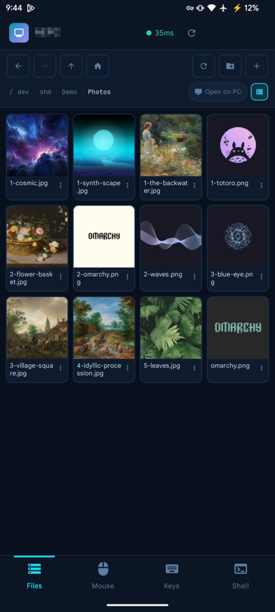
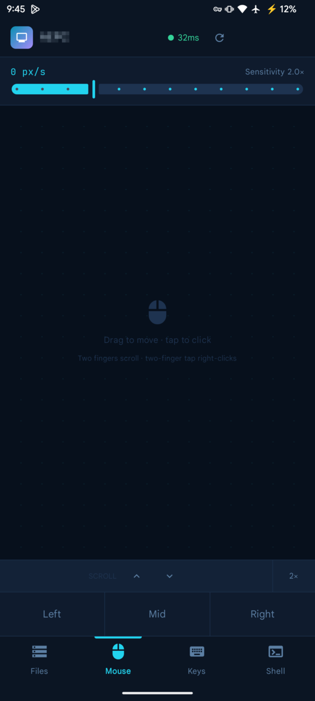
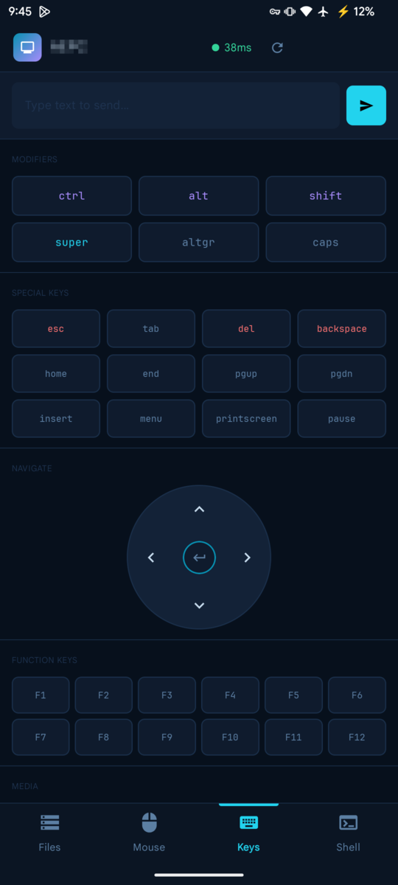
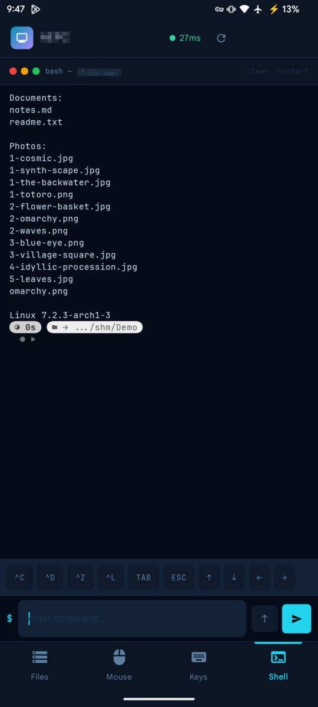

# PC Remote

Control a Linux PC from your phone over Tailscale: a real trackpad, a real
keyboard, a real file manager, and a real shell. Apps for **Android** and
**iOS**, plus a small Python agent on the PC.

```
Phone app  ──HTTP  :8778──▶  pc-agent  ──▶  filesystem, sysinfo, xdg-open
           ──WS    :8779──▶            ──▶  /dev/uinput (mouse/keys), PTY (shell)
```

| | |
|---|---|
| `agent/` | Python daemon on the PC. No third-party framework, just stdlib HTTP + `websockets`. |
| `android/` | Jetpack Compose app, `uk.krodity.pcremote`. |
| `ios/` | SwiftUI app with the same bundle ID, built on Linux with [xtool](https://github.com/xtool-org/xtool). |

> ⚠️ **A paired phone has a shell as you on the PC.** Read the
> [Security model](#security-model) before you install this.


<p align="center">
  
  
  
  
</p>


---

## Contents

- [Requirements](#requirements)
- [What each tab does](#what-each-tab-does)
- [Install](#install)
- [iOS](#ios)
- [Media streaming](#media-streaming)
- [Security model](#security-model)
- [Why uinput rather than ydotool](#why-uinput-rather-than-ydotool)
- [Gotchas worth knowing](#gotchas-worth-knowing)
- [Troubleshooting](#troubleshooting)
- [API](#api)

---

## Requirements

**PC (agent)**

- Linux with systemd (developed on Arch with Hyprland. It doesn't depend on
  the compositor, because input goes in at the kernel level)
- Python 3.10+ with `websockets` (`python-websockets`). `psutil` is optional,
  for the CPU and memory readouts
- Write access to `/dev/uinput` for the Mouse and Keys tabs: a `uaccess` udev
  rule and/or membership of the `input` group (the installer checks)
- [Tailscale](https://tailscale.com/), with ufw if you want the installer to
  add the firewall rules
- For thumbnails (optional): Pillow, `ffmpegthumbnailer`, `pdftoppm`
  (poppler) and ImageMagick
- `xdg-open` for *Open on PC*

**Phone**: Android 8.0+ (API 26), or iOS 17+ through xtool. Tailscale must be
on the phone as well.

## What each tab does

**Mouse** — a relative trackpad. One finger drags the cursor, a tap left-clicks,
two fingers scroll, a two-finger tap right-clicks, and tap-then-drag holds the
button down for select-and-drag. Sensitivity is adjustable 0.5×–6×.

**Keys** — latching modifiers (tap Ctrl, then tap C), special keys, a D-pad,
F1–F12, media keys, and a free-text field that types a whole string. The Quick
Combos are Hyprland-style defaults (`Super+Q` closes a window, `Super+Space`
opens the launcher, `Super+Shift+S` takes a screenshot). See
[Customising the Quick Combos](#customising-the-quick-combos).

**Files** — browse, create, rename, and delete anywhere on the filesystem, in a
detail list or a thumbnail grid.

- **Open on PC / Open in app** — a pill in the breadcrumb row decides where a
  tapped file goes. The default is the PC (`xdg-open` on the desktop), because
  the phone can only handle text and media while the desktop handles
  everything. Switched to *app*, text opens in the built-in editor and media
  streams to a phone player. Both destinations stay reachable from the ⋮ menu
  whichever way the pill is set, and the choice persists.
- **Thumbnails** — the agent renders previews for images, video and PDF
  (Pillow, `ffmpegthumbnailer`, `pdftoppm`), cached on both ends. Video tiles
  carry a play badge so a still and a film are distinguishable at a glance.
- **Streaming** — tapping a video or audio file hands it to whatever player the
  user picks. See *Media streaming* below.

**Shell** — a genuine PTY running your login shell with `-i`, so your aliases,
your prompt and interactive programs (`top`, `vim`, `sudo`'s password prompt)
all work. The control strip supplies the keys a soft keyboard lacks: `^C`, `^D`,
`^Z`, `^L`, Tab, Esc and the arrows.

---

## Install

### 1. Agent on the PC

```bash
git clone https://github.com/Krodity/pc-remote.git
cd pc-remote
./agent/install.sh
```

The installer:

1. checks for `websockets`, `psutil` and `/dev/uinput` access, and tells you
   what's missing;
2. installs `pc-agent.service` as a **user** service (not a system one: it
   injects input into your session and opens a shell as you), then enables
   and starts it;
3. adds ufw rules that only allow ports 8778/8779 on `tailscale0`.

Running it again after a `git pull` upgrades in place. The ports can be
changed with `PC_AGENT_HTTP_PORT` / `PC_AGENT_WS_PORT`. On first start the
agent writes a random pairing token to `~/.config/pc-remote/token`.

Check it's up:

```bash
systemctl --user status pc-agent
curl -H "Authorization: Bearer $(cat ~/.config/pc-remote/token)" http://127.0.0.1:8778/api/ping
```

**No ufw?** The agent binds the wildcard address. Without a firewall rule
it's reachable from **every network the PC is on**, so add an equivalent
nftables/firewalld rule that only allows `tailscale0`.

### 2. App on the phone

Build and install the APK:

```bash
cd android
echo "sdk.dir=$ANDROID_HOME" > local.properties
./gradlew assembleDebug
adb install -r app/build/outputs/apk/debug/pc-remote-1.0.0-debug.apk
```

(For iOS, see [iOS](#ios).)

### 3. Pair

With Tailscale on, open this on the phone's browser:

```
http://<your-pc's tailscale name or 100.x.y.z>:8778/pair
```

and tap **Pair this phone**. The page opens a `pcremote://pair` deep link that
fills in both the host and the token. If you'd rather type them, the Pair
screen takes the host (MagicDNS name, IPv4/IPv6, optionally `:port`) and the
token from `~/.config/pc-remote/token`.

### Customising the Quick Combos

The Keys tab's combo grid is defined in
`android/app/src/main/java/uk/krodity/pcremote/ui/screens/KeysScreen.kt`
(`COMBOS`) and in `ios/Sources/PCRemote/KeysView.swift`. Edit it to match your
desktop's keybinds, then rebuild.

---

## iOS

`ios/` is a SwiftUI port that speaks the same protocol, so the agent needs no
changes. Same four tabs; same pairing link (`pcremote://pair?...` from the
`/pair` page, opened in Safari with Tailscale on).

```bash
cd ios && ./install.sh        # build, sign, install on the USB-connected iPhone
./install.sh build            # build only → ios/xtool/PCRemote.app
```

Needs xtool, a Swift 6 toolchain and an iOS SDK set up (`xtool setup`). With a
free Apple ID, signed apps expire after **7 days**; run `./install.sh` again
to refresh.

Differences from Android, all simplifications:

- **Media streams straight from the agent.** `AVURLAsset` can send the bearer
  header itself, so there is no loopback proxy and no foreground service; the
  token still never leaves the app. AVPlayer only plays Apple's containers
  (MP4/MOV/M4V, MP3/AAC/FLAC/WAV); for MKV/WebM use *Open on PC* or
  *Open with…* (VLC).
- **Shell uses SwiftTerm**, a full xterm emulator, instead of a hand-rolled
  ANSI interpreter. The JetBrains Mono Nerd Font is bundled for the prompt.
- **"Open with…"** is the system share sheet, which also offers Save to Files.
- **The token lives in the Keychain**, not in preferences.
- **Upload from phone** is in the Files ⋯ menu. It streams from disk and
  never overwrites: the agent's `/api/fs/upload` replaces silently, so the app
  picks `name (1).ext` when the name is taken.
- **Formats AVPlayer can't open** (MKV, WebM, AVI…) and downloads over 200 MB
  ask first instead of showing a black player or pulling gigabytes.
- **Smart punctuation is off** in the file editor (a plain `UITextView`, since
  SwiftUI's `TextEditor` can't disable it) and stripped from the Keys text box,
  or saving a config would turn `"` into `“` and `--` into `—`.
- **The socket is probed with a WebSocket ping** on every heartbeat. After a
  trip to the background iOS can leave it looking open while every send goes
  nowhere. A new socket clears latched modifiers, which the agent has already
  released.

Build gotchas, all worked around in the tree:

- **SwiftTerm is vendored** (`ios/Vendor/SwiftTerm`, v1.13.0, MIT). Its
  upstream manifest drops the iOS sources under `#if os(Linux)`, and a
  manifest is evaluated on the *build* host, so fetching it normally builds a
  SwiftTerm with no `TerminalView`. Releases ≥ 1.14 also add a build-info
  plugin whose host tool cannot be built through xtool.
- `Shaders.metal` is a `.copy` resource: there is no Metal compiler on Linux,
  and the optional Metal renderer compiles it from source at runtime.

---

## Media streaming

Media **streams**; it is never downloaded whole. The app runs a **loopback HTTP
server** and gives the player a `http://127.0.0.1:<port>/…` URL; that server
pulls 1 MiB blocks from the agent on demand, a few ahead of the playhead, and
keeps them in a bounded window.

- **The token never leaves the app.** A third-party player cannot send an
  `Authorization` header, and putting the bearer token in a URL would hand a
  credential for this whole machine to an app we do not control. The loopback
  server holds the token and is itself the auth boundary.
- **The window is fixed at 96 MiB per file**, whatever its size. Slots are
  recycled least-recently-used, so playing a 4 GB film to the end costs 96 MiB
  on the phone, not 4 GB. Measured: ~27 MiB resident while streaming an 825 MB
  file.
- **The first and last block are pinned.** Container indexes live at one end or
  the other (Matroska cues, an MP4's moov), and players re-read them on every
  seek; letting them age out makes each scrub cost two extra round trips.
- **Read-ahead is 4 blocks**, on a single thread with one job in flight, so it
  cannot outrun the live read or evict what the player is about to want.

This needs HTTP Range on the agent side, which `/api/fs/download` implements
(`206`, `Content-Range`, suffix ranges, `416`), streaming in 256 KiB chunks so
serving a 4 GB film does not balloon the agent's memory.

**A foreground service runs while streaming.** The loopback server lives in the
app's process, so the moment Android decides the app is a backgrounded nobody
the socket stops being serviced and playback stalls with no useful error. Some
phones are very eager about that: Motorola's `moto_freezer` froze the process
35 seconds in during testing. The service is typed `dataSync`, not `mediaPlayback`:
it transfers file data and does not own a media session, and claiming a type you
do not implement is what gets a foreground service killed. It stops itself once
nothing has read for a minute.

**Picking a default player.** The play intent is a bare `ACTION_VIEW`, not
`createChooser`. A forced chooser cannot be dismissed with *Always*, so it makes
setting a default impossible; a plain intent gets Android's own "Open with"
dialog with *Just once* / *Always*, and the choice sticks.

---

## Security model

**The tailnet is the boundary.** The agent binds the wildcard address and UFW
restricts it to `tailscale0`. The bearer token stops an accidental connection from another tailnet
peer; it is not a second wall.

Be clear about what this grants: a phone that is paired has **a real shell as
your user**, arbitrary keystrokes, and read/write over the whole filesystem. If
your user has passwordless sudo, that is effectively root. This is the point of the
tool — it is exactly the access of the person sitting at the keyboard — but it
means the token deserves the same care as an SSH key.

Traffic is plain HTTP/WS. Tailscale (WireGuard) already provides encryption and
peer authentication; terminating TLS again inside the tunnel would only add a
self-signed certificate to click past.

Two deliberate safety rails:

- **Delete moves to the freedesktop trash**, not `unlink`. A mis-tap on a phone
  is far easier than a mis-click on a desktop. `~/.local/share/Trash` makes it
  recoverable; the API takes `permanent: true` to really remove something.
- **The agent refuses to delete `/` or `$HOME`** regardless of that flag.

---

## Why uinput rather than ydotool

`ydotool` would have worked, but every event would cost a
fork+exec — far too slow for a trackpad streaming deltas at 60 Hz. `ydotoold`
itself sits on the kernel's uinput interface, so the agent opens `/dev/uinput`
directly and skips the round trip.

The bigger win is that uinput injects at the evdev layer, *below* the
compositor: it behaves identically on Hyprland, on X11, or on a bare VT, and it
survives a compositor restart.

Access comes from `/etc/udev/rules.d/50-uinput.rules` (`TAG+="uaccess"`) plus
membership of group `input`.

Keycodes are raw scancodes, so what a key *produces* depends on the active
layout. The character map is **US QWERTY**, matching `kb_layout = us`. Change the layout and typed text will need a new
map; individual keys and combos are unaffected.

---

## Gotchas worth knowing

- **Both wildcards are bound, on purpose.** asyncio's `create_server` forces
  `IPV6_V6ONLY` on an `AF_INET6` socket, so binding only `::` leaves `127.0.0.1`
  and every IPv4 tailnet peer refused. The WS listener takes two sockets; the
  HTTP listener clears `V6ONLY` instead. MagicDNS publishes A *and* AAAA for
  the host, so getting this wrong makes the agent look randomly down.
- **Never `pkill -f pc_agent.py`** — the pattern matches the invoking shell's
  own command line and kills it (exit 144). Use
  `systemctl --user restart pc-agent`, or `pgrep -f 'pc_agent[.]py'` and kill by
  PID.
- A client that drops off Wi-Fi mid-chord would otherwise leave Ctrl held down
  on the desktop; the agent calls `release_all()` on disconnect.
- On Hyprland `Alt+F4` does nothing by default. `Super+Q` closes a window.
- **OkHttp's `newBuilder()` shares the Dispatcher and ConnectionPool** with the
  parent client. The default Dispatcher caps one host at 5 concurrent requests,
  so media block fetches queued the ping call and the socket handshake behind
  them and the app went "offline" the instant a video started. The streaming
  client replaces both.
- Android reaps the WebSocket while the app sits in the background — which is
  exactly what happens when an external player is in the foreground. The ping
  loop notices (agent reachable, socket gone) and rebuilds it, and `onResume`
  triggers the same check immediately.
- **JetBrains Mono is bundled as the Nerd Font build.** With the platform
  monospace font, a powerline prompt renders as tofu boxes. The ANSI
  interpreter also honours background colours for the same reason: powerline
  separator glyphs are drawn in the adjoining segment's background, so dropping
  backgrounds turns the prompt into white blobs.
- Pillow's decompression-bomb guard trips at ~179 MP and refuses very large images
  (e.g. 235 MP upscaler output). Thumbnailing falls back to ImageMagick, which streams through a
  disk-backed pixel cache rather than blowing up memory.

---

## Troubleshooting

| Symptom | Check |
|---|---|
| App says offline | Tailscale is on on both ends. `systemctl --user status pc-agent`. From another tailnet device: `curl http://<pc>:8778/api/ping` should return 401 (reachable), not time out |
| 401 / token rejected | Re-pair from `/pair`. The token is `~/.config/pc-remote/token` (deleting it makes a new one on restart) |
| Mouse/Keys tabs error, Files/Shell fine | `/dev/uinput` isn't writable. Add the `uaccess` rule the installer prints, join the `input` group, and log out and back in |
| Typed text comes out wrong | Your keyboard layout isn't US QWERTY. Single keys and combos still work. See *Why uinput* |
| Video stalls after ~30 s with the screen off | A battery optimiser is freezing the app. Exclude PC Remote from battery optimisation |
| No thumbnails | Install Pillow, `ffmpegthumbnailer`, poppler (`pdftoppm`) and ImageMagick on the PC |
| Agent killed your terminal | You ran `pkill -f pc_agent.py`. Use `systemctl --user restart pc-agent` |

---

## API

All routes need `Authorization: Bearer <token>` except `/pair`.

| Method | Route | |
|---|---|---|
| GET | `/api/ping` | latency probe |
| GET | `/api/sysinfo` | host, OS, kernel, uptime, load, CPU, memory, disk |
| GET | `/api/fs/list?path=` | directory listing, dirs first |
| GET | `/api/fs/read?path=` | text, capped at 2 MB |
| GET | `/api/fs/download?path=` | raw bytes; supports Range, `attach=0` to inline |
| GET | `/api/fs/thumb?path=&size=` | JPEG preview of an image, video or PDF |
| POST | `/api/fs/write` `{path,text}` | |
| POST | `/api/fs/upload?path=` | raw body |
| POST | `/api/fs/mkdir` · `/create` · `/rename` · `/copy` | |
| POST | `/api/fs/delete` `{path,permanent?}` | trash unless `permanent` |
| POST | `/api/exec` `{cmd,cwd?,timeout?}` | one-shot, non-interactive |
| POST | `/api/open` `{path}` | `xdg-open` on the desktop |

WebSocket messages (`ws://host:8779/?token=…`), phone → agent:

```
{"t":"mouse","dx":,"dy":}          {"t":"key","k":"f5"}
{"t":"btn","b":"left","down":}     {"t":"combo","k":"ctrl+shift+s"}
{"t":"click","b":"left","n":2}     {"t":"mod","k":"ctrl","down":true}
{"t":"scroll","dy":1}              {"t":"text","s":"hello"}
{"t":"pty.open","cols":,"rows":}   {"t":"pty.in","d":"ls\n"}
{"t":"pty.size","cols":,"rows":}   {"t":"pty.signal","sig":"SIGINT"}
```

agent → phone: `hello`, `pty.ready`, `pty.out`, `pty.exit`, `pong`, `warn`, `err`.

---

## License

MIT. See [LICENSE](LICENSE). Bundles JetBrains Mono Nerd Font (OFL, see
`docs/OFL-JetBrainsMono.txt`) and, on iOS, SwiftTerm (MIT, `ios/Vendor/SwiftTerm/LICENSE`).
